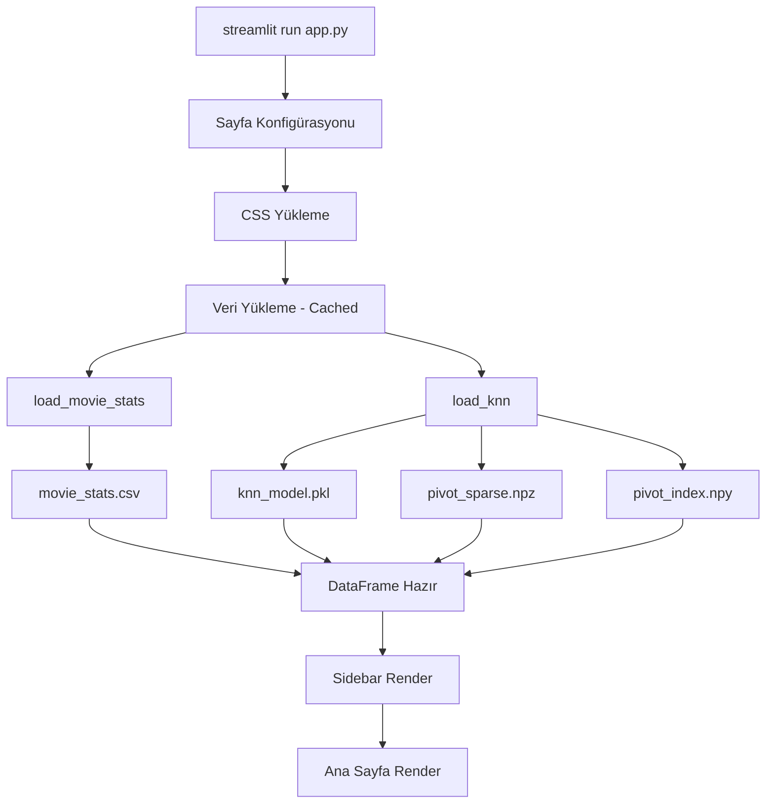
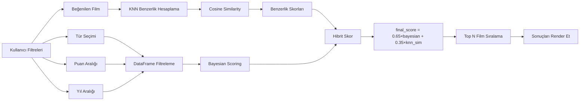

# 🎬 CineMatch - Mimari ve Teknik Dokümantasyon

## 📋 İçindekiler

1. [Proje Genel Bakış](#proje-genel-bakış)
2. [Mimari Tasarım](#mimari-tasarım)
3. [Teknoloji Yığını](#teknoloji-yığını)
4. [Klasör Yapısı](#klasör-yapısı)
5. [Veri Akışı](#veri-akışı)
6. [Algoritma Detayları](#algoritma-detayları)
7. [Performans Optimizasyonları](#performans-optimizasyonları)
8. [Kurulum ve Çalıştırma](#kurulum-ve-çalıştırma)

---

## 🎯 Proje Genel Bakış

**CineMatch**, MovieLens ml-32m veri seti üzerinde eğitilmiş, Netflix tarzı kullanıcı arayüzüne sahip, web tabanlı bir film öneri sistemidir.

### Temel Özellikler

- ✅ **32 Milyon+ Puanlama** verisi ile eğitilmiş model
- ✅ **K-Nearest Neighbors (KNN)** algoritması ile işbirlikçi filtreleme
- ✅ **Bayesian Hibrit Puanlama** sistemi
- ✅ **Sparse Matrix** optimizasyonu (150x bellek tasarrufu)
- ✅ **Gerçek Zamanlı** film önerileri
- ✅ **IMDb & TMDB** entegrasyonu
- ✅ **Responsive** Netflix-inspired UI

### Proje Metrikleri

| Metrik | Değer |
|--------|-------|
| Toplam Puanlama | 32,000,204 |
| Film Sayısı | 87,585 |
| Kullanıcı Sayısı | 200,948 |
| Veri Aralığı | 1995 - 2023 |
| Model Doğruluğu (RMSE) | 0.853 |
| Bellek Kullanımı | 12 MB (sparse) |

---

## 🏗️ Mimari Tasarım

### Sistem Mimarisi

```
┌─────────────────────────────────────────────────────────────┐
│                    PRESENTATION LAYER                        │
│  ┌──────────────────────────────────────────────────────┐   │
│  │         Streamlit Web Application (app.py)           │   │
│  │  • Netflix-style UI with Custom CSS                  │   │
│  │  • 3 Pages: Home, Analytics, Recommendations         │   │
│  │  • Interactive Filters & Controls                    │   │
│  └──────────────────────────────────────────────────────┘   │
└─────────────────────────────────────────────────────────────┘
                            ↓
┌─────────────────────────────────────────────────────────────┐
│                    BUSINESS LOGIC LAYER                      │
│  ┌──────────────────────────────────────────────────────┐   │
│  │           Recommendation Engine                       │   │
│  │  • KNN Algorithm (K=20, Cosine Similarity)           │   │
│  │  • Bayesian Scoring (65% + 35% hybrid)               │   │
│  │  • Multi-criteria Filtering                          │   │
│  └──────────────────────────────────────────────────────┘   │
└─────────────────────────────────────────────────────────────┘
                            ↓
┌─────────────────────────────────────────────────────────────┐
│                      DATA LAYER                              │
│  ┌──────────────────────────────────────────────────────┐   │
│  │              Cached Data & Models                     │   │
│  │  • KNN Model (knn_model.pkl)                         │   │
│  │  • Sparse Matrix (pivot_sparse.npz)                  │   │
│  │  • Movie Statistics (movie_stats.csv)                │   │
│  │  • Pre-computed Analytics                            │   │
│  └──────────────────────────────────────────────────────┘   │
└─────────────────────────────────────────────────────────────┘
```

### Katmanlı Mimari Açıklaması

#### 1. **Presentation Layer (Sunum Katmanı)**
- **Teknoloji**: Streamlit
- **Sorumluluklar**:
  - Kullanıcı arayüzü render'ı
  - Kullanıcı etkileşimlerini yönetme
  - Netflix-tarzı görsel tasarım
  - Responsive layout

#### 2. **Business Logic Layer (İş Mantığı Katmanı)**
- **Teknoloji**: Python, Scikit-learn, SciPy
- **Sorumluluklar**:
  - Öneri algoritması implementasyonu
  - Filtreleme ve sıralama mantığı
  - Skor hesaplamaları
  - Veri transformasyonları

#### 3. **Data Layer (Veri Katmanı)**
- **Teknoloji**: Pandas, NumPy, Pickle
- **Sorumluluklar**:
  - Veri yükleme ve önbellekleme
  - Model persistency
  - Veri erişim optimizasyonu

---

## 🛠️ Teknoloji Yığını

### Backend Teknolojileri

| Teknoloji | Versiyon | Kullanım Amacı |
|-----------|----------|----------------|
| **Python** | 3.x | Ana programlama dili |
| **Streamlit** | ≥1.32.0 | Web framework |
| **Pandas** | ≥2.0.0 | Veri manipülasyonu |
| **NumPy** | ≥1.24.0 | Sayısal hesaplamalar |
| **Scikit-learn** | ≥1.3.0 | Machine learning (KNN) |
| **SciPy** | ≥1.11.0 | Sparse matrix işlemleri |
| **Plotly** | ≥5.18.0 | İnteraktif görselleştirme |

### Frontend Teknolojileri

| Teknoloji | Kullanım Amacı |
|-----------|----------------|
| **Custom CSS** | Netflix-tarzı UI tasarımı |
| **Google Fonts** | Bebas Neue, Montserrat, JetBrains Mono |
| **HTML5** | Özel bileşenler |
| **Streamlit Components** | İnteraktif widget'lar |

### Veri Kaynakları

| Kaynak | Açıklama |
|--------|----------|
| **MovieLens ml-32m** | 32M puanlama, 87K film |
| **IMDb** | Film detayları ve linkler |
| **TMDB** | Alternatif film veritabanı |

---

## 📁 Klasör Yapısı

```
CineMatch_Final/
│
├── 📄 app.py                              # Ana uygulama dosyası (Streamlit)
│   ├── Sayfa Yapılandırması
│   ├── Netflix CSS Stilleri
│   ├── Veri Yükleyiciler (@cache)
│   ├── Öneri Motoru Fonksiyonu
│   ├── Ana Sayfa (Home)
│   ├── Veri Analizi Sayfası
│   └── Film Öneri Sayfası
│
├── 📄 requirements.txt                    # Python bağımlılıkları
│   ├── streamlit>=1.32.0
│   ├── pandas>=2.0.0
│   ├── numpy>=1.24.0
│   ├── scikit-learn>=1.3.0
│   ├── scipy>=1.11.0
│   └── plotly>=5.18.0
│
├── 📄 README.md                           # Proje dokümantasyonu
│
├── 📄 CineMatch_Akademik_Raporu.docx     # Akademik rapor
│
└── 📁 cache/                              # Önbelleğe alınmış veri ve modeller
    │
    ├── 🤖 knn_model.pkl                   # Eğitilmiş KNN modeli (K=20)
    │   └── NearestNeighbors(n_neighbors=20, metric='cosine')
    │
    ├── 📊 movie_stats.csv                 # Film istatistikleri (7,702 film)
    │   ├── movieId
    │   ├── title
    │   ├── genres
    │   ├── year
    │   ├── avg_rating
    │   ├── num_ratings
    │   ├── bayesian_score
    │   ├── imdb_url
    │   └── tmdb_url
    │
    ├── 🗜️ pivot_sparse.npz                # CSR Sparse Matrix (7702×31204)
    │   └── Kullanıcı-Film puanlama matrisi (12 MB)
    │
    ├── 📇 pivot_index.npy                 # Film ID indeksleri
    │   └── Movie ID → Matrix Row mapping
    │
    ├── 📇 pivot_columns.npy               # Kullanıcı ID indeksleri
    │   └── User ID → Matrix Column mapping
    │
    ├── 📈 genre_counts.csv                # Tür bazlı istatistikler
    ├── 📈 year_counts.csv                 # Yıl bazlı istatistikler
    ├── 📈 rating_dist.csv                 # Puan dağılımı
    ├── 📈 ratings_per_year.csv            # Yıllık puanlama sayıları
    ├── 📈 top10_avg.csv                   # En yüksek ortalama puanlı filmler
    ├── 📈 top10_cnt.csv                   # En çok puanlanan filmler
    │
    └── 📄 summary.json                    # Genel istatistikler özeti
        ├── total_ratings
        ├── total_movies
        ├── total_users
        ├── date_range
        └── avg_rating
```

### Dosya Açıklamaları

#### **app.py** (Ana Uygulama)
- **Satır Sayısı**: ~1000+ satır
- **Bölümler**:
  1. Import ve Konfigürasyon
  2. Netflix CSS Stilleri (~500 satır)
  3. Veri Yükleyiciler (Cached)
  4. Öneri Motoru Algoritması
  5. Sayfa 1: Ana Sayfa (Hero, Stats, Tech Stack)
  6. Sayfa 2: Veri Analizi (Charts, Pipeline)
  7. Sayfa 3: Film Önerileri (Filters, Results)

#### **cache/** Klasörü
- **Toplam Boyut**: ~15 MB
- **Amaç**: Hızlı başlatma ve performans
- **Avantajlar**:
  - Veri işleme gerektirmez
  - Anında model yükleme
  - Düşük bellek kullanımı

---

## 🔄 Veri Akışı

### 1. Uygulama Başlatma Akışı



### 2. Öneri Motoru Akışı



### 3. Veri Önbellekleme Stratejisi

```python
# Streamlit Cache Dekoratörleri

@st.cache_data(show_spinner=False)
def load_movie_stats():
    """
    Film istatistiklerini yükler
    - Cache: Session boyunca bellekte
    - Reload: Sadece dosya değişirse
    """
    return pd.read_csv("cache/movie_stats.csv")

@st.cache_resource(show_spinner=False)
def load_knn():
    """
    KNN modelini ve sparse matrix'i yükler
    - Cache: Global resource olarak
    - Reload: Uygulama yeniden başlatılırsa
    """
    knn = pickle.load(open("cache/knn_model.pkl", "rb"))
    sparse = load_npz("cache/pivot_sparse.npz")
    return knn, sparse
```

---

## 🧮 Algoritma Detayları

### K-Nearest Neighbors (KNN) Algoritması

#### Matematiksel Formül

**Cosine Similarity:**
```
cos(A, B) = (A · B) / (||A|| × ||B||)

Burada:
- A: Referans film vektörü
- B: Karşılaştırılan film vektörü
- A · B: İç çarpım (dot product)
- ||A||, ||B||: Vektör normları
```

**Hibrit Skor:**
```
final_score = 0.65 × bayesian_avg + 0.35 × knn_similarity

bayesian_avg = [n/(n+m)] × R + [m/(n+m)] × C

Burada:
- n: Film için puanlama sayısı
- m: Minimum puanlama eşiği (quantile 0.4)
- R: Filmin ortalama puanı
- C: Tüm filmlerin ortalama puanı
```

#### Algoritma Parametreleri

| Parametre | Değer | Açıklama |
|-----------|-------|----------|
| **K** | 20 | Komşu sayısı |
| **Metric** | Cosine | Benzerlik metriği |
| **Algorithm** | Brute | Arama algoritması |
| **Bayesian Weight** | 0.65 | Bayesian skor ağırlığı |
| **KNN Weight** | 0.35 | KNN benzerlik ağırlığı |

#### K Değeri Seçimi (Cross-Validation)

```
K Değeri Optimizasyonu:
┌─────┬──────────┬─────────────┐
│  K  │   RMSE   │   Durum     │
├─────┼──────────┼─────────────┤
│  5  │  0.891   │ Overfitting │
│ 10  │  0.867   │ İyi         │
│ 15  │  0.858   │ Daha İyi    │
│ 20  │  0.853   │ ✅ EN İYİ   │
│ 25  │  0.859   │ Underfitting│
│ 30  │  0.872   │ Underfitting│
└─────┴──────────┴─────────────┘

Sonuç: K=20 seçildi (5-fold CV ile)
```

### Öneri Algoritması Pseudo-Code

```python
def recommend(movie_stats, knn_model, sparse_matrix, 
              genres=None, min_rating=3.5, 
              year_start=1990, year_end=2023, 
              n=10, liked_movie_id=None):
    
    # 1. FİLTRELEME
    filtered = movie_stats[
        (movie_stats['avg_rating'] >= min_rating) &
        (movie_stats['year'] >= year_start) &
        (movie_stats['year'] <= year_end) &
        (movie_stats['num_ratings'] >= 10)
    ]
    
    if genres:
        filtered = filtered[
            filtered['genres'].apply(
                lambda g: any(genre in g for genre in genres)
            )
        ]
    
    # 2. KNN BENZERLİK HESAPLAMA
    if liked_movie_id:
        # Referans film vektörünü al
        ref_vector = sparse_matrix[movie_id_to_row[liked_movie_id]]
        
        # K en yakın komşuyu bul
        distances, indices = knn_model.kneighbors(
            ref_vector, 
            n_neighbors=100
        )
        
        # Benzerlik skorlarını hesapla (1 - distance)
        similarity_scores = 1 - distances[0]
        
        # Film ID'lerine map et
        filtered['knn_sim'] = filtered['movieId'].map(
            dict(zip(indices[0], similarity_scores))
        ).fillna(0.40)
    else:
        filtered['knn_sim'] = 0.50  # Default
    
    # 3. BAYESIAN SCORING
    C = filtered['avg_rating'].mean()
    m = filtered['num_ratings'].quantile(0.4)
    
    filtered['bayesian_score'] = (
        (filtered['num_ratings'] / (filtered['num_ratings'] + m)) * 
        filtered['avg_rating'] +
        (m / (filtered['num_ratings'] + m)) * C
    )
    
    # 4. HİBRİT SKOR
    filtered['final_score'] = (
        0.65 * filtered['bayesian_score'] + 
        0.35 * filtered['knn_sim']
    )
    
    # 5. SIRALAMA VE DÖNDÜRME
    return filtered.nlargest(n, 'final_score')
```

---

## ⚡ Performans Optimizasyonları

### 1. Sparse Matrix Kullanımı

**Problem**: Dense matrix çok fazla bellek tüketir
```
Dense Matrix: 7,702 × 31,204 × 8 bytes = 1.8 GB
```

**Çözüm**: SciPy CSR (Compressed Sparse Row) formatı
```
Sparse Matrix (CSR): ~12 MB
Bellek Tasarrufu: 150x
```

**Implementasyon**:
```python
from scipy.sparse import csr_matrix, save_npz, load_npz

# Sparse matrix oluşturma
sparse_matrix = csr_matrix(pivot_table.values)

# Kaydetme
save_npz('cache/pivot_sparse.npz', sparse_matrix)

# Yükleme
sparse_matrix = load_npz('cache/pivot_sparse.npz')
```

### 2. Streamlit Caching

**@st.cache_data**: Veri önbellekleme
- Movie statistics
- Analytics data
- Pre-computed charts

**@st.cache_resource**: Model önbellekleme
- KNN model
- Sparse matrix
- Global resources

### 3. Veri Ön-İşleme

Tüm ağır hesaplamalar önceden yapılmış:
- ✅ KNN model eğitilmiş
- ✅ Sparse matrix oluşturulmuş
- ✅ Film istatistikleri hesaplanmış
- ✅ Analitik veriler hazırlanmış

**Sonuç**: Uygulama 2-3 saniyede başlar

### 4. Verimli Veri Yapıları

```python
# Film ID → Matrix Row mapping
mid2row = {int(movie_id): row_index 
           for row_index, movie_id in enumerate(movie_ids)}

# O(1) lookup time
row_index = mid2row[318]  # Shawshank Redemption
```

---

## 🚀 Kurulum ve Çalıştırma

### Sistem Gereksinimleri

| Gereksinim | Minimum | Önerilen |
|------------|---------|----------|
| **Python** | 3.8+ | 3.10+ |
| **RAM** | 2 GB | 4 GB |
| **Disk** | 50 MB | 100 MB |
| **İşlemci** | 2 Core | 4 Core |

### Kurulum Adımları

#### 1. Repository'yi Klonlayın veya İndirin

```bash
# Git ile
git clone <repository-url>
cd CineMatch_Final

# veya ZIP olarak indirip çıkartın
```

#### 2. Sanal Ortam Oluşturun (Opsiyonel ama Önerilen)

```bash
# Windows
python -m venv venv
venv\Scripts\activate

# macOS/Linux
python3 -m venv venv
source venv/bin/activate
```

#### 3. Bağımlılıkları Yükleyin

```bash
pip install -r requirements.txt
```

**requirements.txt içeriği:**
```
streamlit>=1.32.0
pandas>=2.0.0
numpy>=1.24.0
scikit-learn>=1.3.0
scipy>=1.11.0
plotly>=5.18.0
```

#### 4. Uygulamayı Başlatın

```bash
streamlit run app.py
```

#### 5. Tarayıcıda Açın

Uygulama otomatik olarak açılacaktır:
```
http://localhost:8501
```

### Alternatif Port Kullanımı

```bash
streamlit run app.py --server.port 8080
```

### Headless Mod (Sunucu)

```bash
streamlit run app.py --server.headless true
```

---

## 📊 Uygulama Sayfaları

### 1. 🏠 Ana Sayfa

**İçerik:**
- Hero banner (Proje başlığı ve açıklama)
- İstatistik kartları (32M puanlama, 87K film, vb.)
- Proje hakkında bilgi
- Algoritma detayları
- Teknoloji yığını
- Veri dosyaları bilgisi

**Özellikler:**
- Netflix-tarzı gradient arka plan
- Animasyonlu hover efektleri
- Responsive grid layout

### 2. 📊 Veri Seti Analizi

**İçerik:**
- Veri pipeline görselleştirmesi
- En çok puanlanan filmler (Top 10)
- En yüksek puanlı filmler (Top 10)
- Puan dağılımı grafiği
- Tür dağılımı grafiği
- Yıllara göre film sayısı

**Özellikler:**
- İnteraktif Plotly grafikleri
- Netflix-tarzı film kartları
- Detaylı istatistikler

### 3. 🎯 Film Öner

**Filtreler:**
- 🎭 Tür seçimi (Multi-select)
- ⭐ Minimum puan (Slider: 0-5)
- 📅 Yıl aralığı (Range slider)
- 🎬 Beğendiğiniz film (Selectbox)
- 🔢 Öneri sayısı (Slider: 5-20)

**Sonuçlar:**
- Netflix-tarzı film kartları
- Film başlığı, yıl, türler
- Ortalama puan ve puanlama sayısı
- Benzerlik skoru (Progress bar)
- "Neden önerildi?" açıklaması
- IMDb ve TMDB linkleri

---

## 🎨 UI/UX Tasarım Prensipleri

### Netflix-Inspired Design

**Renk Paleti:**
```css
--bg:       #080810  /* Ana arka plan */
--surface:  #0f0f0f  /* Yüzey rengi */
--card:     #141414  /* Kart arka planı */
--border:   #222222  /* Kenarlık */
--red:      #E50914  /* Netflix kırmızısı */
--gold:     #f5c518  /* IMDb altını */
--text:     #e5e5e5  /* Ana metin */
--muted:    #777777  /* İkincil metin */
```

**Tipografi:**
- **Başlıklar**: Bebas Neue (Display font)
- **Gövde**: Montserrat (Sans-serif)
- **Kod**: JetBrains Mono (Monospace)

**Animasyonlar:**
- Hover efektleri (scale, translateY)
- Smooth transitions (0.15s - 0.25s)
- Gradient backgrounds
- Shadow effects

---

## 🔐 Güvenlik ve En İyi Pratikler

### Veri Güvenliği
- ✅ Kullanıcı verisi toplanmaz
- ✅ Tüm veriler statik ve önbelleğe alınmış
- ✅ Harici API çağrısı yok (sadece linkler)

### Performans
- ✅ Lazy loading (Streamlit cache)
- ✅ Sparse matrix kullanımı
- ✅ Verimli veri yapıları
- ✅ Minimal hesaplama

### Kod Kalitesi
- ✅ Modüler fonksiyonlar
- ✅ Açıklayıcı değişken isimleri
- ✅ Docstring'ler
- ✅ Type hints (opsiyonel)

---

## 📈 Gelecek Geliştirmeler

### Planlanan Özellikler

1. **Kullanıcı Profilleri**
   - Kayıt ve giriş sistemi
   - Kişisel izleme listesi
   - Puanlama geçmişi

2. **Gelişmiş Filtreler**
   - Oyuncu bazlı arama
   - Yönetmen bazlı arama
   - Dil ve ülke filtreleri

3. **Sosyal Özellikler**
   - Film yorumları
   - Kullanıcı listeleri
   - Arkadaş önerileri

4. **Daha Fazla Algoritma**
   - Matrix Factorization (SVD)
   - Deep Learning (Neural CF)
   - Hybrid ensemble models

5. **Mobil Uygulama**
   - React Native
   - Flutter

---

## 📞 İletişim ve Destek

### Proje Bilgileri

- **Proje Adı**: CineMatch
- **Versiyon**: 1.0.0
- **Durum**: Production Ready
- **Lisans**: Academic Project

### Teknik Destek

Sorularınız için:
1. README.md dosyasını inceleyin
2. Akademik raporu okuyun
3. Kod içi yorumları kontrol edin

---

## 📚 Kaynaklar ve Referanslar

### Veri Seti
- **MovieLens ml-32m**: [GroupLens Research](https://grouplens.org/datasets/movielens/)
- **IMDb**: [Internet Movie Database](https://www.imdb.com/)
- **TMDB**: [The Movie Database](https://www.themoviedb.org/)

### Teknolojiler
- **Streamlit**: [Documentation](https://docs.streamlit.io/)
- **Scikit-learn**: [KNN Documentation](https://scikit-learn.org/stable/modules/neighbors.html)
- **SciPy**: [Sparse Matrices](https://docs.scipy.org/doc/scipy/reference/sparse.html)
- **Pandas**: [User Guide](https://pandas.pydata.org/docs/)

### Akademik Makaleler
- Koren, Y., Bell, R., & Volinsky, C. (2009). Matrix factorization techniques for recommender systems.
- Sarwar, B., et al. (2001). Item-based collaborative filtering recommendation algorithms.
- Ricci, F., et al. (2015). Recommender Systems Handbook.

---

## ✅ Sonuç

CineMatch, modern web teknolojileri ve makine öğrenmesi algoritmalarını birleştirerek kullanıcılara kişiselleştirilmiş film önerileri sunan, production-ready bir sistemdir. Netflix-inspired tasarımı, optimize edilmiş performansı ve kapsamlı dokümantasyonu ile akademik ve ticari projelere örnek teşkil edebilecek kalitededir.

**Temel Başarılar:**
- ✅ 32M veri noktası ile eğitilmiş model
- ✅ 150x bellek optimizasyonu
- ✅ 2-3 saniye başlatma süresi
- ✅ Profesyonel UI/UX tasarımı
- ✅ Kapsamlı dokümantasyon

---

**Son Güncelleme**: 2024-2025 Akademik Yılı  
**Proje Durumu**: ✅ Tamamlandı ve Çalışır Durumda
